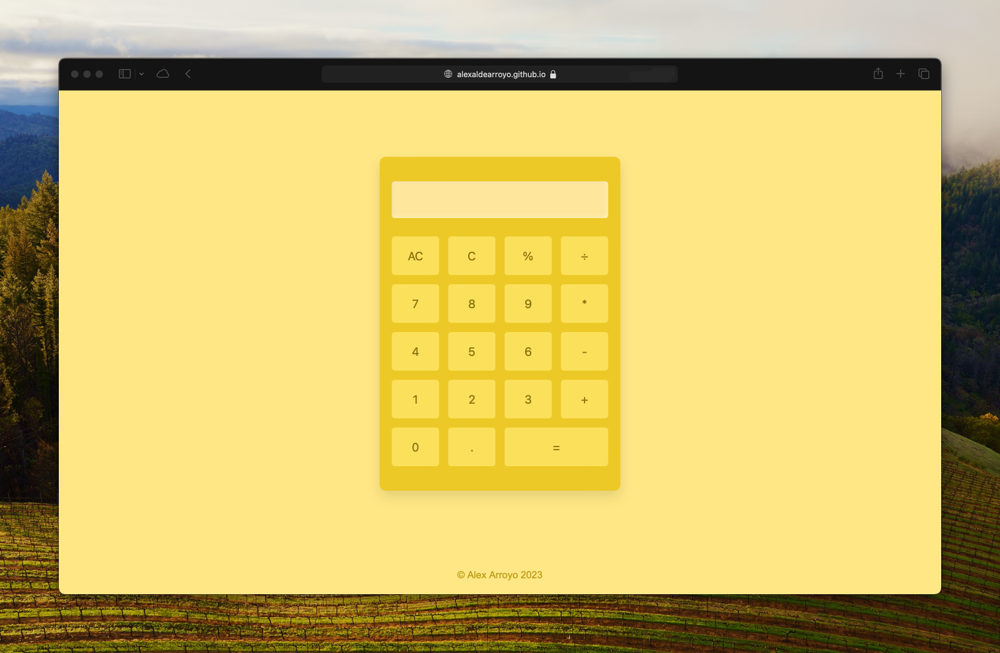

### CALCULATOR

## Description

This repository contains the code for a simple yet stylish web-based calculator. It is designed with a modern and user-friendly interface, making it easy for anyone to use. The calculator is built using vanilla JavaScript, HTML, and CSS, ensuring it is lightweight and fast.

## Features

- Basic arithmetic operations: Addition, subtraction, multiplication, and 
division.
- Responsive design: Works on desktop, tablet, and mobile devices.
- Modern user interface: A clean and intuitive design that is easy on the eyes.
- Keyboard support: Use your keyboard for quick input.

## Live Demo

You can view a live demo of the calculator at 
[alexaldearroyo.github.io/calculator](https://alexaldearroyo.github.io/calculator).

## Usage

Simply enter the numbers you want to calculate using the on-screen buttons or 
your keyboard. The calculator will display the result as you type. To clear the 
display, press the 'C' button.

## Credits

&copy; Alex Arroyo 2023
